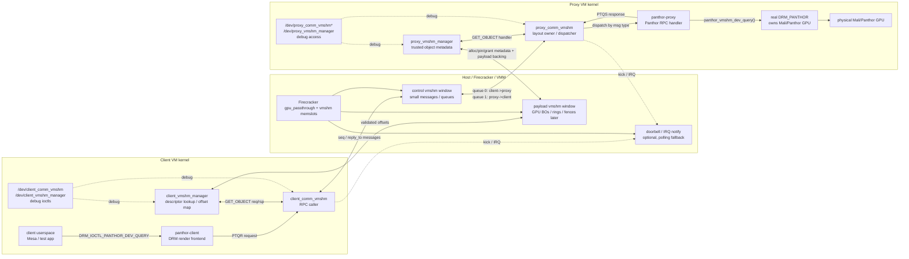
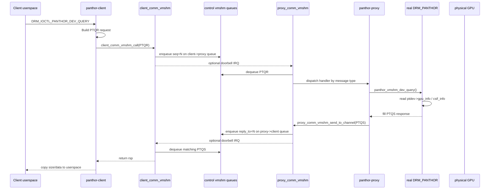
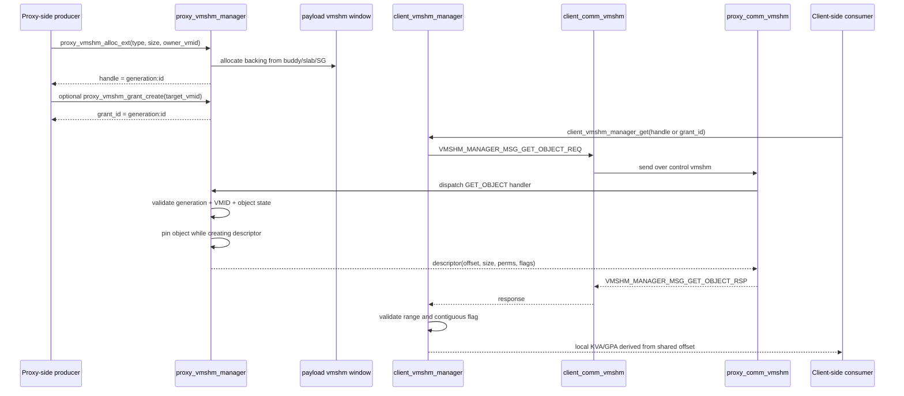
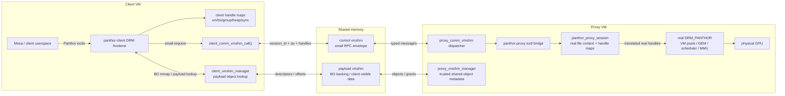

# Linux-Guest-GPU GPU Virtualization Driver Analysis

This document analyzes the GPU virtualization related drivers in
`Linux-Guest-GPU`, focusing on the drivers added for the Firecracker
multi-VM GPU prototype.

## 1. Overall Design

The current implementation is a split GPU virtualization prototype:

- The **proxy VM** owns the real Mali/Panthor GPU and runs the real
  `DRM_PANTHOR` driver.
- The **client VM** does not access the real GPU directly. It exposes a small
  Panthor-compatible frontend and forwards supported requests to the proxy VM.
- The two VMs communicate through VMM-provided shared memory windows called
  `vmshm`.
- Control messages and GPU payload/shared objects are intentionally separated:
  `*_vmshm_comm` is the control transport, while `*_vmshm_manager` manages a
  payload/object shared memory window.

The Panthor frontend has moved beyond the original discovery-only stage. The
current one-client prototype supports the Panthor resource, memory, sync,
submit, and cleanup ioctls needed by the local `panthor_ioctl_smoke` suite and
by a Mesa/Panfrost GLES compute smoke. It has passed a 16-mode one-client ioctl
sweep and a real compute workload through:

```text
client VM userspace
  -> panthor-client DRM frontend
  -> vmshm-comm control RPC
  -> panthor-proxy
  -> real proxy-side DRM_PANTHOR
  -> physical GPU through the custom passthrough path
```

The important remaining caveat is scope: this is one proxy VM plus one client
VM. It does not yet prove multi-client scheduling/isolation, reset recovery,
long-run leak freedom, PRIME/dma-buf/fd transport, or sustained performance
under large memory pressure.

High-level request flow:

```text
client userspace
  -> /dev/dri/card* or /dev/dri/renderD*
  -> panthor-client DRM ioctl
  -> client_comm_vmshm_call()
  -> shared-memory control queue
  -> proxy_comm_vmshm dispatch
  -> panthor-proxy handler
  -> real panthor_vmshm_* helper
  -> proxy response
  -> client copies data back to userspace
```

### 1.1 Overall Architecture Diagram



The key split is:

- `control vmshm window`: fixed-size, small RPC messages. This is where
  `client_comm_vmshm` and `proxy_comm_vmshm` run their two-queue protocol.
- `payload vmshm window`: object memory. This is where future GPU buffers,
  command buffers, submit/event rings, fence pages, and transfer buffers can
  live. The proxy manager owns the trusted metadata for those objects.

### 1.2 DEV_QUERY Sequence Diagram



### 1.3 Object Manager Flow



## 2. Source Map

The main files are:

| Area | File | Role |
| --- | --- | --- |
| Control transport ABI | `Linux-Guest-GPU/include/linux/vmshm_comm.h` | In-kernel tx/rx API, message envelope, selftest/perf message types |
| Proxy control transport | `Linux-Guest-GPU/drivers/char/proxy_vmshm_comm/proxy_comm_vmshm.c` | Initializes and owns the shared-memory control protocol on proxy side |
| Client control transport | `Linux-Guest-GPU/drivers/char/client_vmshm_comm/client_comm_vmshm.c` | Attaches to proxy-created protocol and provides synchronous RPC helper |
| Object manager ABI | `Linux-Guest-GPU/include/linux/vmshm_manager.h` | GET_OBJECT request/response and object descriptor format |
| Proxy object API | `Linux-Guest-GPU/include/linux/proxy_vmshm.h` | Allocation, lookup, pin, grant, span translation APIs |
| Client object API | `Linux-Guest-GPU/include/linux/client_vmshm.h` | Client lookup and offset-to-local-KVA/GPA APIs |
| Proxy payload window device | `Linux-Guest-GPU/drivers/char/proxy_vmshm_manager/proxy_vmshm.c` | Maps payload shared memory, exposes debug character device |
| Proxy object manager | `Linux-Guest-GPU/drivers/char/proxy_vmshm_manager/proxy_vmshm_manager.c` | Trusted object/grant metadata and allocator |
| Client object manager | `Linux-Guest-GPU/drivers/char/client_vmshm_manager/client_vmshm_manager.c` | Client-side descriptor lookup and mapping view |
| Panthor vmshm ABI | `Linux-Guest-GPU/include/linux/panthor_vmshm.h` | Panthor-specific message IDs and request/response structs |
| Client Panthor frontend | `Linux-Guest-GPU/drivers/gpu/drm/panthor-client/panthor_client_drv.c` | DRM render-node frontend for client VM |
| Proxy Panthor bridge | `Linux-Guest-GPU/drivers/gpu/drm/panthor-proxy/panthor_proxy_drv.c` | Proxy-side handler that calls the real Panthor driver |
| Real Panthor hook | `Linux-Guest-GPU/drivers/gpu/drm/panthor/panthor_drv.c` | Exports `panthor_vmshm_dev_query()` for proxy bridge |

The important Kconfig entries are:

- `CONFIG_PROXY_VMSHM_COMM`
- `CONFIG_CLIENT_VMSHM_COMM`
- `CONFIG_PROXY_VMSHM_MANAGER`
- `CONFIG_CLIENT_VMSHM_MANAGER`
- `CONFIG_DRM_PANTHOR_PROXY`
- `CONFIG_DRM_PANTHOR_CLIENT`

Expected build split:

| Kernel | Expected options |
| --- | --- |
| Proxy VM kernel | `PROXY_VMSHM_COMM`, `PROXY_VMSHM_MANAGER`, `DRM_PANTHOR`, `DRM_PANTHOR_PROXY` |
| Client VM kernel | `CLIENT_VMSHM_COMM`, `CLIENT_VMSHM_MANAGER`, `DRM_PANTHOR_CLIENT`, with real `DRM_PANTHOR` disabled |

## 3. Control Transport: `vmshm_comm`

### 3.1 Purpose

`vmshm_comm` is the control-plane transport between client VM and proxy VM. It
does not define GPU semantics by itself. Upper layers provide message types
such as:

- `PANTHOR_VMSHM_MSG_DEV_QUERY_REQ`
- `PANTHOR_VMSHM_MSG_DEV_QUERY_RSP`
- `VMSHM_MANAGER_MSG_GET_OBJECT_REQ`
- `VMSHM_MANAGER_MSG_GET_OBJECT_RSP`

The generic envelope is:

```c
struct vmshm_comm_tx {
	u32 type;
	u32 flags;
	u64 seq;
	u64 reply_to;
	s32 status;
	const void *payload;
	u32 len;
};

struct vmshm_comm_rx {
	u32 type;
	u32 flags;
	u64 seq;
	u64 reply_to;
	s32 status;
	void *payload;
	u32 payload_capacity;
	u32 len;
	struct proxy_comm_vmshm_channel *proxy_channel;
};
```

`seq` identifies a request. `reply_to` binds a response to a request. This is
what lets the client side implement synchronous RPC over a shared ring.

### 3.2 Proxy Side: `proxy_comm_vmshm`

`proxy_comm_vmshm` maps a device-tree memory region with:

```dts
compatible = "proxy_comm_vmshm";
reg = <gpa_base size>;
```

Its job is to create a small virtqueue-like protocol layout inside that shared
window. The layout contains:

- A shared header with magic/version/status fields.
- An object table describing protocol objects.
- Two queues:
  - queue 0: client to proxy
  - queue 1: proxy to client
- For each queue:
  - descriptor table
  - avail ring
  - used ring
  - fixed-size message pool

The proxy side initializes the protocol by writing `PROXY_COMM_VMSHM_MAGIC`
after building the layout. It also sets proxy status to `READY`.

Runtime responsibilities:

- Send responses to a particular client channel with
  `proxy_comm_vmshm_send_to_channel()`.
- Receive client requests and dispatch them to registered handlers.
- Support either interrupt/doorbell notification or polling thread fallback.
- Provide `/dev/proxy_comm_vmshm*` for debug read/write/ioctl access.
- Provide optional hello/perf selftests for bring-up.

The handler registry is intentionally generic. A GPU-specific module registers
a handler by message type:

```c
proxy_comm_vmshm_register_handler(type, handler, priv);
```

Then `proxy_comm_vmshm` drains incoming requests and invokes the matching
handler.

### 3.3 Client Side: `client_comm_vmshm`

`client_comm_vmshm` maps a corresponding device-tree memory region with:

```dts
compatible = "client_comm_vmshm";
reg = <gpa_base size>;
```

Unlike the proxy side, the client side does not build the layout. It waits for
the proxy side to publish a valid `PROXY_COMM_VMSHM_MAGIC`, validates the
layout, and then sets client status to `READY`.

Runtime responsibilities:

- `client_comm_vmshm_send_to_proxy()` sends a message to queue 0.
- `client_comm_vmshm_recv_from_proxy()` receives from queue 1.
- `client_comm_vmshm_call()` provides synchronous request/response RPC.
- In IRQ mode, it keeps a waiter list and completes waiters from RX work.
- In polling mode, it sends a request and polls for the matching response.
- It exposes `/dev/client_comm_vmshm` for debug/ioctl.

Important behavior: `client_comm_vmshm_call()` is serialized by `rpc_lock`.
That is simple and useful for bring-up, but it means concurrent client-side
RPCs currently run one at a time.

### 3.4 Transport Properties

Current fixed limits:

- Queue count: `2`
- Queue depth: `256`
- Message size: `512` bytes
- Max handler slots on proxy: `16`
- Max proxy channels: `32`

The protocol stores offsets relative to the shared window, not kernel virtual
addresses. That is the right shape for cross-VM shared memory. The code comment
also notes that the ABI is currently same-architecture/native-endian; if this
becomes a stable cross-architecture ABI, the shared structs should move to
explicit `__le32`/`__le64` fields.

## 4. Shared Object Manager: `vmshm_manager`

### 4.1 Why This Exists

The object manager is the beginning of the data-plane memory model. It is
separate from `vmshm_comm` because control messages should stay small and
stable, while GPU buffers, rings, fence pages, and transfer buffers need their
own lifecycle and permission model.

The proxy VM is the trusted owner of all object metadata. The shared memory
payload window contains object bytes only; metadata such as owner, generation,
grant target, permissions, and pin count stays in proxy-private kernel memory.

This design is important because a client VM must not be able to forge object
metadata by writing into shared memory.

### 4.2 Proxy Payload Window Device: `proxy_vmshm.c`

`proxy_vmshm.c` maps the payload shared memory region:

```dts
compatible = "proxy-vmshm-manager";
reg = <gpa_base size>;
```

It exposes `/dev/proxy_vmshm_manager` with:

- `read`
- `write`
- `mmap`
- `llseek`
- ioctls for size/base/selftest

This device is mainly a bring-up/debug access path for the whole payload
window. During probe, it calls:

```c
proxy_vmshm_manager_init(base, gpa, size);
```

That initializes the real in-kernel object manager.

### 4.3 Proxy Object Manager: `proxy_vmshm_manager.c`

This is the core metadata manager.

It manages:

- A reserved prefix of the shared payload window.
- A buddy allocator for page-sized and larger allocations.
- Slab caches for small objects up to 2 KiB.
- Optional scatter-gather backing for objects that cannot be contiguous.
- Object metadata in an xarray.
- Grant metadata in an xarray.
- ID allocation through IDA.
- Generation counters for ABA-resistant handles.
- Refcount and pin count for object lifetime.

Supported object types are defined in `include/linux/proxy_vmshm.h`:

- `PROXY_VMSHM_OBJ_GENERIC`
- `PROXY_VMSHM_OBJ_GPU_BO`
- `PROXY_VMSHM_OBJ_COMMAND_BO`
- `PROXY_VMSHM_OBJ_SUBMIT_RING`
- `PROXY_VMSHM_OBJ_EVENT_RING`
- `PROXY_VMSHM_OBJ_FENCE_PAGE`
- `PROXY_VMSHM_OBJ_TRANSFER_BUFFER`

The external object handle is:

```text
handle = generation:32 | object_id:32
```

The generation protects against stale handles after an ID is reused. Grants use
the same idea:

```text
grant_id = generation:32 | grant_id:32
```

Important exported APIs:

- `proxy_vmshm_alloc_ext()`
- `proxy_vmshm_free()`
- `proxy_vmshm_free_handle()`
- `proxy_vmshm_lookup_pin()`
- `proxy_vmshm_unpin()`
- `proxy_vmshm_obj_translate()`
- `proxy_vmshm_grant_create()`
- `proxy_vmshm_grant_lookup_pin()`
- `proxy_vmshm_grant_revoke()`

The object states are:

- `ALLOCATED`: visible in the object table, no active grant.
- `GRANTED`: visible and at least one grant points to it.
- `REVOKING`: being removed from lookup paths.
- `ZOMBIE`: removed from object table but still pinned by an in-flight user.

The pin model is the safety mechanism that prevents returning backing memory
to the allocator while another path is still using it.

### 4.4 Manager RPC: GET_OBJECT

During initialization, the proxy object manager registers a control handler for:

```c
VMSHM_MANAGER_MSG_GET_OBJECT_REQ
```

The client can ask for an object descriptor by either:

- direct handle: `VMSHM_MANAGER_LOOKUP_HANDLE`
- grant ID: `VMSHM_MANAGER_LOOKUP_GRANT`

The proxy lookup path validates:

- handle/grant ID format
- generation
- object existence
- owner VMID for handle lookup
- target VMID for grant lookup
- object state

Then it pins the object, fills a descriptor, and unpins after generating the
response.

Current descriptor support is limited to contiguous objects:

```c
if (!proxy_vmshm_obj_is_contiguous(obj))
	return -EOPNOTSUPP;
```

The returned descriptor contains:

- handle
- id
- generation
- type
- perms
- offset inside shared payload window
- size
- allocation size
- proxy-side GPA
- contiguous flag
- segment count

### 4.5 Client Object Manager: `client_vmshm_manager.c`

The client manager maps the same payload shared memory window, but deliberately
does not allocate or free from it.

Its responsibilities:

- Map the payload window locally with `memremap()`.
- Expose readiness and offset translation helpers.
- Ask the proxy manager for object descriptors via `client_comm_vmshm_call()`.
- Validate returned descriptors.
- Convert shared offsets into client-local KVA/GPA.
- Expose `/dev/client_vmshm_manager` ioctls for debug/inspection.

The client character device intentionally rejects raw `read`, `write`, and
`mmap` with `-EPERM`. That matches the design: client-side access should happen
through validated descriptors, not by mapping the whole shared payload window
from userspace.

Current client descriptor support is also contiguous-only:

```c
if (!(desc->flags & VMSHM_MANAGER_DESC_F_CONTIG))
	return -EOPNOTSUPP;
if (desc->nr_segments != 1)
	return -EOPNOTSUPP;
```

## 5. Panthor Virtualization Layer

### 5.1 Panthor vmshm ABI

`include/linux/panthor_vmshm.h` defines the Panthor-specific message ABI:

- `PANTHOR_VMSHM_MSG_DEV_QUERY_REQ` (`"PTQR"`)
- `PANTHOR_VMSHM_MSG_DEV_QUERY_RSP` (`"PTQS"`)

The request contains:

- query type
- requested size
- flags

The response contains:

- `ret`
- query type
- real size
- data length
- inline data buffer

The only defined flag is:

```c
PANTHOR_VMSHM_DEV_QUERY_F_DATA
```

If this flag is absent, the request asks only for the required size. If present,
the proxy returns query data inline in the response.

### 5.2 Client Panthor Frontend: `panthor-client`

`drivers/gpu/drm/panthor-client/panthor_client_drv.c` is the client VM's
frontend.

It registers a DRM driver named `panthor` with the DRM features needed by
Mesa's Panthor/Panfrost path, including render, GEM, syncobj, syncobj timeline,
and GPUVA-related behavior. The current client frontend handles the core
Panthor private ioctls and the DRM core ioctls needed for virtual BO and
syncobj operation:

```text
DEV_QUERY
VM_CREATE / VM_DESTROY / VM_BIND / VM_GET_STATE
BO_CREATE / BO_MMAP_OFFSET / GEM_CLOSE
GROUP_CREATE / GROUP_DESTROY / GROUP_GET_STATE / GROUP_SUBMIT
TILER_HEAP_CREATE / TILER_HEAP_DESTROY
SYNCOBJ_CREATE / DESTROY / WAIT / TRANSFER / TIMELINE_WAIT
SYNCOBJ_RESET / SIGNAL / TIMELINE_SIGNAL / QUERY
```

It also explicitly rejects fd-based ioctls that are unsafe across VM
boundaries:

```text
DRM_IOCTL_PRIME_HANDLE_TO_FD
DRM_IOCTL_PRIME_FD_TO_HANDLE
DRM_IOCTL_SYNCOBJ_HANDLE_TO_FD
DRM_IOCTL_SYNCOBJ_FD_TO_HANDLE
DRM_IOCTL_SYNCOBJ_EVENTFD
```

The earlier `/dev/panthor` character-device compatibility path was removed.
Userspace validation now goes through the normal DRM nodes under `/dev/dri`,
which is the path Mesa and libdrm use.

For `DEV_QUERY`, the flow remains:

1. `panthor_client_ioctl_dev_query()` receives the DRM ioctl.
2. `panthor_client_dev_query()` converts it to
   `panthor_vmshm_dev_query_req`.
3. `panthor_client_rpc_dev_query()` calls `client_comm_vmshm_call()`.
4. The response is validated.
5. If the userspace pointer was null, the frontend returns the required size.
6. If the pointer was non-null, it copies returned data back to userspace and
   clears unused tail bytes.

The other supported ioctls follow the same rule: the client copies and
validates user pointers in the client VM, translates client-visible handles to
per-session proxy handles, sends fixed metadata through `vmshm-comm`, and only
uses `vmshm-object` for BO payloads that client userspace or the GPU must
directly access.

The frontend also has optional boot-time selftests:

- `CONFIG_DRM_PANTHOR_CLIENT_DEV_QUERY_SELFTEST`
- `CONFIG_DRM_PANTHOR_CLIENT_DEV_QUERY_PERF_SELFTEST`

These query GPU/CSIF data and measure DEV_QUERY RTT through the full
client/proxy path.

### 5.3 Proxy Panthor Bridge: `panthor-proxy`

`drivers/gpu/drm/panthor-proxy/panthor_proxy_drv.c` is small and deliberately
focused.

At module init it registers a `proxy_comm_vmshm` handler for:

```c
PANTHOR_VMSHM_MSG_DEV_QUERY_REQ
```

On each request:

1. It validates the payload length.
2. It copies the request into a local struct.
3. It calls `panthor_vmshm_dev_query()`.
4. It sends a `PANTHOR_VMSHM_MSG_DEV_QUERY_RSP` back to the client channel.
5. It retries the send if the response queue is temporarily full.

This bridge is the boundary between generic VM shared-memory transport and the
real proxy-side Panthor DRM driver.

### 5.4 Real Panthor Hook

`drivers/gpu/drm/panthor/panthor_drv.c` is modified to export:

```c
int panthor_vmshm_dev_query(const struct panthor_vmshm_dev_query_req *req,
			    struct panthor_vmshm_dev_query_rsp *rsp);
```

The hook reads from the real `struct panthor_device`:

- `ptdev->gpu_info`
- `ptdev->csif_info`

It supports:

- `DRM_PANTHOR_DEV_QUERY_GPU_INFO`
- `DRM_PANTHOR_DEV_QUERY_CSIF_INFO`

The hook uses:

- `panthor_vmshm_lock` to protect the global proxy-side `panthor_vmshm_ptdev`
  pointer.
- `drm_dev_get()` / `drm_dev_put()` to hold the DRM device while servicing the
  request.
- `drm_dev_enter()` / `drm_dev_exit()` to avoid using an unplugged device.

During real Panthor probe, the driver stores the active `ptdev` in
`panthor_vmshm_ptdev`. During remove, it clears that pointer.

This means the current implementation assumes one real Panthor device for the
proxy bridge. Multi-GPU support would need device/channel routing rather than a
single global pointer.

## 6. End-to-End DEV_QUERY Flow

The implemented GPU virtualization path today is DEV_QUERY:

```text
client userspace
  calls DRM_IOCTL_PANTHOR_DEV_QUERY

panthor-client
  builds panthor_vmshm_dev_query_req
  type = GPU_INFO or CSIF_INFO
  flags = DATA if userspace supplied pointer

client_comm_vmshm
  assigns seq
  writes message PTQR into client->proxy queue
  kicks proxy by doorbell if IRQ mode is enabled
  waits for PTQS reply_to = seq

proxy_comm_vmshm
  drains client->proxy queue
  dispatches PTQR to panthor-proxy handler

panthor-proxy
  calls panthor_vmshm_dev_query()

real panthor
  reads ptdev->gpu_info or ptdev->csif_info
  fills response

panthor-proxy
  writes PTQS into proxy->client queue
  kicks client if IRQ mode is enabled

client_comm_vmshm
  receives PTQS
  wakes matching waiter

panthor-client
  copies returned size/data to userspace
```

The effect is that client userspace sees enough of a Panthor DRM node to
discover the real GPU, while actual hardware ownership stays inside the proxy
VM.

## 7. End-to-End Object Lookup Flow

The object manager path is not yet wired into Panthor BO submission, but the
infrastructure is present.

Intended object/grant lookup flow:

```text
proxy-side producer
  proxy_vmshm_alloc_ext()
  gets object handle
  optionally proxy_vmshm_grant_create(target_vmid)

client-side consumer
  client_vmshm_manager_get(handle or grant_id)
  sends VMSHM_MANAGER_MSG_GET_OBJECT_REQ

proxy_vmshm_manager
  validates handle/grant generation and VMID
  pins object
  returns contiguous descriptor
  unpins object

client_vmshm_manager
  validates descriptor range
  maps offset to local KVA/GPA
  returns client_vmshm_object to caller
```

This is the base needed for future GPU virtualization features such as command
buffers, shared submit rings, event rings, fence pages, and transfer buffers.

## 8. What Each Driver Is For

### `proxy_comm_vmshm`

This is the proxy-side control-plane transport. Its role is similar to a tiny
VMM-provided virtqueue transport implemented over a raw shared memory memslot.
It owns protocol initialization and dispatches typed requests to in-kernel
handlers.

It is not GPU-specific. Panthor and the object manager are just users of this
transport.

### `client_comm_vmshm`

This is the client-side control-plane transport. It attaches to the proxy-owned
layout and exposes a clean in-kernel RPC API. It is the reason higher-level
client drivers do not need to understand ring layout details.

It is also not GPU-specific.

### `proxy_vmshm_manager`

This is the trusted memory-object authority for the proxy VM. It creates and
tracks shared objects that may later represent GPU BOs, command buffers, rings,
or fences. Its most important design point is that object metadata lives only
in proxy-private kernel memory.

It is GPU-oriented infrastructure, but generic enough to support non-Panthor
shared objects too.

### `client_vmshm_manager`

This is the read-only client view of proxy-managed objects. It lets client-side
drivers resolve an authorized handle/grant into a local mapping. It prevents
the client from managing allocator state or mapping the entire shared window
through the character device.

### `panthor-client`

This is the current visible GPU frontend in the client VM. It makes client
userspace see a Panthor-like DRM render node. It now virtualizes the one-client
Panthor ioctl surface needed for BO lifecycle, VM_BIND, syncobj/timeline waits,
group submission, tiler heap lifecycle, and session cleanup. The current test
evidence includes both the full ioctl smoke sweep and a real GLES compute task.

### `panthor-proxy`

This is the proxy-side Panthor RPC adapter. It translates a generic vmshm
message into a call to the real Panthor driver and translates the result back
into a vmshm response.

### Real `panthor` modifications

These changes expose in-kernel helpers for the proxy bridge. Instead of making
the proxy bridge fake GPU state, the bridge reuses the real initialized Panthor
device state and real Panthor VM/GEM/MMU/scheduler/syncobj paths.

## 9. Current Limitations And Risks

### 9.1 One-client scope

The current supported surface is a one-proxy-one-client prototype. It proves
that the virtual Panthor ioctl path can run the available smoke suite and a
small real GLES compute workload, but it does not yet prove:

- multiple client VMs using the same proxy GPU concurrently
- cross-client handle namespace isolation under adversarial or racing access
- fairness, scheduling policy, throttling, or accounting
- reset recovery after GPU faults or client/proxy crashes
- long-run leak freedom under repeated create/submit/destroy cycles
- sustained performance under large BOs, many mappings, or high submit rate

Two-client tests should be explicit experiments, not inferred from the
one-client pass.

### 9.2 Permission fields are not fully enforced

`proxy_vmshm_lookup_pin()` and `proxy_vmshm_grant_lookup_pin()` currently accept
`required_perms`, but the implementation casts it away. Owner/target VMID and
generation are validated, but permission bits are not yet enforced.

Before this becomes multi-tenant or security-sensitive, the lookup path should
check:

```text
(object_or_grant_perms & required_perms) == required_perms
```

### 9.3 Descriptor lifetime needs a stronger contract

The proxy validates and pins an object while generating a descriptor, then
unpins before sending the descriptor back. That is fine for discovery/debug, but
for real GPU submissions the client must not rely on an old offset forever.

Future submit paths should revalidate handles/grants at submit time or hold a
longer-lived lease/reference so an object cannot be freed and its offset reused
while the client still treats the descriptor as valid.

### 9.4 Contiguous-only client descriptors

The proxy manager has SG backing support and span translation APIs, but
`GET_OBJECT` currently returns only contiguous descriptors. The client manager
rejects multi-segment descriptors.

For real GPU BOs, this is acceptable only if the design requires contiguous
shared backing or if later protocol versions add segment tables.

### 9.5 Single real Panthor device

`panthor_vmshm_ptdev` is a single global pointer. That is enough for one proxy
GPU, but multi-GPU or multi-tenant routing would need an explicit device ID in
the request/channel binding.

### 9.6 Handler dispatch runs under handler lock

`proxy_comm_vmshm_dispatch_one()` finds and invokes the registered handler while
holding `proxy_comm_vmshm_handler_lock`. This is simple, but it serializes all
handlers and can block handler registration/unregistration while a handler does
work or retries response sends.

For higher-throughput paths, dispatch should probably copy out the handler/priv
under the lock, release the lock, and then invoke the handler with separate
lifetime rules.

### 9.7 Native-endian shared structs

The shared protocol structs are native-endian and same-architecture today. That
matches the prototype, but a stable ABI should use explicit endian types and
carefully documented layout/versioning.

### 9.8 Fixed 512-byte control messages

Panthor DEV_QUERY works because the returned data is small. Larger future
ioctls should not blindly expand inline control messages. They should use
shared objects for large payloads and keep the control channel for descriptors,
handles, and status.

### 9.9 `PANTHOR_VMSHM_MAX_QUERY_DATA`

The Panthor response buffer is currently sized as:

```c
#define PANTHOR_VMSHM_MAX_QUERY_DATA sizeof(struct drm_panthor_gpu_info)
```

That covers the implemented query data today, but adding new query types should
revisit this limit.

### 9.10 Debug character devices expose powerful access

The proxy payload device allows raw read/write/mmap of the shared payload
window. That is useful for bring-up, but production use should restrict or
remove this path so proxy-side userspace cannot accidentally corrupt allocator
owned objects.

## 10. Virtualizing The Remaining Panthor IOCTLs

The remaining Panthor ioctls should not be virtualized as raw ioctl-number
forwarding. A Panthor ioctl is tied to a `struct drm_file`: GEM handles,
syncobj handles, VM IDs, group handles, tiler heap handles, mmap fake offsets,
and scheduler fences are all scoped to one DRM file context. In the current
client/proxy split, the client VM's `drm_file` is not the same object as the
proxy VM's real Panthor `drm_file`, so those identifiers have no meaning across
the VM boundary.

The right model is to add a proxy-side **Panthor session** for every client-side
open of the virtual Panthor render node. That session represents one real
Panthor file context on the proxy side, and the client frontend keeps
client-visible handles that map to proxy-real handles.

### 10.1 Proposed Session-Based Architecture



The minimum new state is:

- `session_id`: returned by a new virtual `OPEN` RPC and attached to every
  ioctl RPC after that.
- A proxy-side `struct panthor_proxy_session` that owns the real Panthor state.
- Client-visible ID spaces for VMs, BOs, groups, tiler heaps, and sync objects.
- Mapping tables:
  - client VM ID -> proxy VM ID
  - client BO handle -> proxy GEM handle and optional vmshm object
  - client group handle -> proxy group handle
  - client heap handle -> proxy heap handle
  - client syncobj/timeline handle -> proxy syncobj/timeline or virtual fence

The practical consequence: the client frontend should look like a Panthor DRM
driver to userspace, while the proxy bridge should look like a real Panthor
userspace client to the real driver.

### 10.2 RPC Shape

Keep `vmshm-comm` for control metadata and flattened transient ioctl arrays.
Use `vmshm-object` only for payloads that the client VM must directly
`mmap`/read/write or that the physical GPU must access as BO backing. The
Panthor UAPI has several nested `drm_panthor_obj_array` fields; those contain
userspace pointers that are valid only inside the client VM. The proxy must
never dereference them.

A useful protocol shape is:

```c
struct panthor_vmshm_ioctl_req {
	__u64 session_id;
	__u32 op;
	__u32 flags;
	__u64 inline_arg;
	__u64 payload_handle;
	__u32 payload_size;
	__u32 payload_count;
};

struct panthor_vmshm_ioctl_rsp {
	__s32 ret;
	__u32 flags;
	__u64 inline_arg;
	__u64 payload_handle;
	__u32 payload_size;
	__u32 reserved;
};
```

The current implementation uses more specific fixed request/response structs
rather than one generic ioctl envelope. The important rules are:

- Small fixed structs are sent inline through `vmshm-comm`.
- Transient arrays are copied from client userspace by `panthor-client`,
  validated, translated, flattened, and carried inside the `vmshm-comm` request
  when they fit the bounded protocol limits.
- Do not put transient ioctl arrays in `vmshm-object`. This includes
  `VM_BIND ops[]`, VM_BIND sync arrays, syncobj handle/point arrays,
  `GROUP_CREATE queues[]`, and `GROUP_SUBMIT queue_submits[]/syncs[]`.
- If an array grows beyond the fixed protocol limits, add a deliberate
  control-plane extension or batching scheme; do not silently repurpose BO
  payload object memory as a generic transfer object.
- Responses return the same fields that the real ioctl mutates, such as
  returned VM ID, BO handle, heap GPU VA, or updated failing `ops.count`.
- `seq` and `reply_to` in `vmshm_comm` still provide request/reply matching,
  but `session_id` provides DRM-file ownership.

### 10.3 IOCTL-by-IOCTL Analysis

| IOCTL | Real Panthor meaning | Virtualization strategy | Difficulty |
| --- | --- | --- | --- |
| `VM_CREATE` | Creates a GPU address space in `pfile->vms`; returns a VM ID. | Direct RPC. Proxy creates real VM in the session, returns proxy VM ID, client allocates a client VM ID and records the mapping. `user_va_range` returned by proxy should be copied back unchanged. | Low |
| `VM_DESTROY` | Destroys a VM from the file's VM pool. | Translate client VM ID to proxy VM ID, call proxy destroy, then remove the client mapping. Destroy should also reject or clean dependent client BO/group/heap mappings. | Low |
| `VM_GET_STATE` | Reports whether a VM is usable or unusable after faults/async bind failure. | Translate VM ID, query proxy state, return state unchanged. | Low |
| `BO_CREATE` | Creates a GEM object in the real DRM file handle table; may be exclusive to one VM. | RPC plus memory-model decision. Translate `exclusive_vm_id`, create a proxy GEM handle, then return a client-visible BO handle. For early bring-up, require `DRM_PANTHOR_BO_NO_MMAP` and keep the BO proxy-owned. For CPU-visible BOs, back the BO with vmshm or implement a copy/import path. | High |
| `BO_MMAP_OFFSET` | Returns a fake offset valid for `mmap()` on the same real DRM file. | Do not return the proxy fake offset directly; it is meaningless in the client VM. Client driver must return a client-local fake offset and implement `.mmap` to map a vmshm-backed object. If the BO was created with `NO_MMAP` or no shared backing exists, return `-EINVAL`/`-EOPNOTSUPP`. | High |
| `VM_BIND` | Maps/unmaps GEM ranges into a GPU VM; async mode uses syncobjs and scheduler jobs. | Copy bind ops and nested sync arrays from client userspace, translate `vm_id`, `bo_handle`, and syncobj handles, then send bounded flattened arrays through `vmshm-comm`. GPU VAs pass through because the real GPU executes in the proxy-created Panthor VM. | High |
| `GROUP_CREATE` | Creates a scheduling group and queues bound to one VM. | Copy the queue array into the bounded `vmshm-comm` request, translate `vm_id`, proxy creates the group, return a client group handle mapped to the proxy group handle. Priority checks should be enforced on the proxy side; client-side checks are only advisory. | Medium |
| `GROUP_DESTROY` | Destroys a scheduling group. | Translate group handle, call proxy destroy, remove mapping. Also define what happens to in-flight submits and virtual fences. | Low/Medium |
| `GROUP_GET_STATE` | Returns timeout/fatal-fault state and fatal queue mask. | Translate group handle, query proxy, return state/fatal queues unchanged. | Low |
| `GROUP_SUBMIT` | Submits command streams to group queues; stream addresses are GPU VAs; sync arrays describe waits/signals. | Copy `queue_submits` and nested sync arrays into the bounded `vmshm-comm` request, translate group and sync handles, ensure command stream BOs were created and bound in the proxy VM at the same GPU VAs, submit on proxy, then reflect completion through proxy-backed syncobjs/fences. Zero-length submit is protocol evidence; nonzero submit plus readback is execution evidence. | Very high |
| `TILER_HEAP_CREATE` | Allocates tiler heap objects in a VM and returns heap handle plus GPU VAs. | Translate VM ID, call proxy create, return GPU VAs unchanged and map a client heap handle to proxy heap handle. The returned GPU VAs are meaningful because later jobs execute in the proxy-created GPU VM. | Medium |
| `TILER_HEAP_DESTROY` | Destroys a tiler heap. | Translate client heap handle to proxy heap handle, call proxy destroy, remove mapping. Be careful because real heap handles encode VM ID in the high bits. | Low/Medium |

### 10.4 Why The Hard IOCTLs Are Hard

`BO_CREATE`, `BO_MMAP_OFFSET`, `VM_BIND`, and `GROUP_SUBMIT` are the core of
real GPU virtualization. They are hard because they cross three identifier
domains at once:

- DRM file-local handles: GEM handles and syncobj handles are not global.
- GPU VA space: command streams use GPU virtual addresses, so the proxy VM must
  reproduce the client-visible GPU address layout in the real Panthor VM.
- CPU memory visibility: userspace may write command buffers through CPU
  mappings, but the physical GPU can only DMA from memory visible to the proxy
  and host.

The existing `vmshm_manager` gives you the beginning of the data-plane answer:
allocate/grant/pin shared payload objects, pass descriptors over the control
path, and let both VMs see the same bytes. To turn that into Panthor BO backing,
you still need one of these memory models:

1. **vmshm-backed BO.** Best fit for the current infrastructure and the
   validated path.
   BO storage lives in the payload shared-memory window; client userspace maps
   it through the virtual DRM frontend, and the proxy imports/maps the same
   pages into the real Panthor GEM/MMU path. This needs careful cacheability,
   DMA mapping, SG/contiguous descriptor support, and lifetime pinning.
2. **Shadow/copy BO.** Client maps local memory, proxy owns real GEM memory,
   and the frontend copies dirty ranges before submit and copies readback ranges
   after completion. This is easier to prototype than true shared backing, but
   slower and semantically tricky for coherent CPU/GPU sharing.

The old proxy-owned BO plus explicit upload path should not be revived for the
current GLES target. It would create a second memory model and make mmap
readback/cache ordering harder to reason about. Keep BO payloads in
`vmshm-object` and keep ioctl metadata in `vmshm-comm`.

### 10.5 Client Frontend Responsibilities

`panthor-client` should become more than a DEV_QUERY forwarder:

- Implement `.open` and `.postclose` hooks that create/destroy a proxy session.
- Register all Panthor ioctls only as they become semantically supported.
- Copy `drm_panthor_obj_array` payloads from client userspace in the client VM.
- Validate count/stride/MBZ fields before sending to the proxy, mirroring the
  real driver's `PANTHOR_UOBJ_GET_ARRAY` behavior.
- Allocate client-visible handles and store xarray mappings to proxy handles.
- Translate all handles before sending an RPC and translate returned handles
  before copying results back to userspace.
- Implement `.mmap` for virtual BOs if CPU mapping is supported. This mmap path
  must map client-side vmshm descriptors or a local shadow object, not the proxy
  DRM fake mmap offset.
- Expose `DRIVER_GEM`, `DRIVER_SYNCOBJ`, `DRIVER_SYNCOBJ_TIMELINE`, and
  `DRIVER_GEM_GPUVA` only when the client frontend really supports the matching
  semantics.

### 10.6 Proxy Bridge Responsibilities

`panthor-proxy` needs to become a stateful bridge:

- Maintain `struct panthor_proxy_session` objects indexed by `session_id` and
  bound to the originating proxy channel/client VMID.
- Own or represent a real Panthor file context for each session.
- Keep proxy-side xarrays for real VM IDs, GEM handles, groups, heaps, syncobjs,
  and in-flight submit resources.
- Validate every payload handle/grant with `proxy_vmshm_manager` before use.
- Pin payload objects while the real GPU or proxy worker can still access them.
- Translate client packed arrays into real Panthor UAPI structs with proxy
  handles and proxy-valid kernel pointers.
- Return exact Linux error codes so client userspace sees normal Panthor
  behavior.

There is one major implementation decision here: the current real
`panthor_ioctl_*()` functions are `static` and expect a real `struct drm_file`.
The proxy bridge therefore cannot cleanly call them as-is. You need either:

- Refactor the real driver so ioctl bodies call exported/internal helpers that
  accept a `panthor_file`/session and already-copied kernel arrays.
- Or create a real/synthetic proxy-side `drm_file` per session and invoke the
  normal DRM ioctl path inside the proxy. This preserves handle-table semantics
  but is more invasive and easy to get wrong.

The first option is usually cleaner for an in-kernel proxy because it avoids
pretending to be userspace while still reusing the real Panthor VM, GEM, MMU,
heap, and scheduler helpers.

### 10.7 Sync Object Virtualization

`VM_BIND_ASYNC` and `GROUP_SUBMIT` both use `struct drm_panthor_sync_op`, whose
`handle` field is a DRM syncobj or timeline syncobj handle. These handles are
per `drm_file`, so the client handle cannot be passed to the proxy.

Current one-client implementation:

- maps client syncobj handles to proxy syncobj handles
- preserves timeline point values
- rewrites wait/signal/transfer/query operations with proxy handles
- supports async VM_BIND sync arrays and GROUP_SUBMIT sync arrays through
  bounded flattened `vmshm-comm` requests
- exposes `DRIVER_SYNCOBJ` and `DRIVER_SYNCOBJ_TIMELINE` only because those
  virtualized paths exist

Remaining sync work is about depth rather than first enablement: stress larger
arrays, long waits, timeout races, close-while-waiting, fault/reset behavior,
and multi-client namespace isolation. `DRM_IOCTL_SYNCOBJ_EVENTFD`,
`SYNCOBJ_HANDLE_TO_FD`, and `SYNCOBJ_FD_TO_HANDLE` remain intentionally
unsupported until there is an explicit cross-VM fd/eventfd protocol.

This is necessary because Panthor's submit path updates syncobjs after
`drm_sched_job_arm()` and pushes job fences into the scheduler. Without a real
virtual fence model, userspace could submit work but never observe completion
correctly.

### 10.8 Current Implementation Boundary

The implementation has already crossed the basic bring-up sequence:

1. **Session RPC:** `OPEN_SESSION` / `CLOSE_SESSION` are tied to client DRM
   open/close and clean up leftover session resources.
2. **Resource ioctls:** VM, group, tiler heap, and state-query lifecycles are
   virtualized with per-session handle translation.
3. **BO and mmap:** BO creation returns client-visible handles, allocates
   `vmshm-object` payloads, provides client-local fake mmap offsets, and maps
   payload pages into client userspace.
4. **VM_BIND:** synchronous and async VM_BIND use bounded flattened op/sync
   arrays in `vmshm-comm`; proxy VM_BIND maps vmshm-backed payload pages
   through the real Panthor path.
5. **Syncobj/timeline:** create/destroy/wait/transfer/reset/signal/query
   operations translate client handles to proxy syncobj handles.
6. **GROUP_SUBMIT:** submit metadata and nested sync arrays are flattened into
   `vmshm-comm`; nonzero command streams have been exercised by GLES compute.

The next engineering work is hardening those paths under larger and more
adversarial conditions, not adding another basic Panthor ioctl number.

### 10.9 Critical Rules

- Do not dereference client userspace pointers in the proxy VM.
- Do not pass proxy GEM handles, syncobj handles, or mmap offsets directly back
  as if they were valid in the client DRM file.
- Do not let old vmshm descriptors outlive the object/grant lifetime; pin or
  revalidate through submit completion.
- Enforce `required_perms` before using shared payload objects for CPU write,
  GPU read/write, submit, signal, or mmap.
- Preserve the two-memslot rule: transient ioctl metadata belongs to
  `vmshm-comm`; BO payloads and other client-visible data objects belong to
  `vmshm-object`.
- Treat proxy-side checks as authoritative. Client-side validation improves
  error quality, but it is not a security boundary.
- Define teardown semantics first: closing the client DRM file must destroy or
  revoke all proxy VMs, BOs, groups, heaps, syncobjs, payload pins, and grants
  owned by that session.

## 11. Suggested Next Steps

The next steps are now hardening and scaling, not basic DEV_QUERY bring-up:

1. Keep the one-client ioctl suite as a regression gate for every protocol or
   memory-model change.
2. Enforce `required_perms` in object and grant lookup before treating the path
   as multi-tenant safe.
3. Add stronger lease or submit-time revalidation rules for vmshm-object
   descriptors so object offsets cannot be reused while the client or GPU still
   treats them as live.
4. Add explicit two-client namespace/isolation tests for VM, BO, syncobj, group,
   heap, and payload handles.
5. Stress VM_BIND with larger BOs, multi-span payloads, async sync arrays,
   partial failures, cleanup unmaps, and memory pressure.
6. Stress real GPU workloads beyond the current compute smoke: repeated
   dispatches, larger buffers, more ALU work, graphics/tiler jobs, and reset or
   fault recovery.
7. Decide whether BO backing must remain contiguous or add SG descriptor
   protocol support to `VMSHM_MANAGER_MSG_GET_OBJECT_RSP`.
8. Keep PRIME/dma-buf/syncobj-fd/eventfd ioctls disabled unless a real
   cross-VM fd/grant/eventfd protocol is designed and tested.
9. Remove the single global Panthor device assumption if multiple GPUs or
   multiple proxy devices are in scope.
10. Split proxy handler lookup from handler execution if response handlers begin
   doing heavier work.

## 12. Summary

Your drivers have moved from a clean first-stage transport prototype to a
working one-client split GPU virtualization prototype.

The most complete part is the control transport: `proxy_comm_vmshm` and
`client_comm_vmshm` provide a typed, request/response message path over shared
memory with optional doorbell IRQs and polling fallback.

The second important part is the object manager: `proxy_vmshm_manager` and
`client_vmshm_manager` define how future GPU buffers/rings/fences can be
allocated, named, granted, looked up, and translated across VM address spaces.

The Panthor layer now proves more than `DEV_QUERY`: client userspace can create
VMs and BOs, mmap shared payloads, bind them into the proxy-created GPU VA
space, create syncobjs, submit nonzero command streams through `GROUP_SUBMIT`,
wait for proxy-backed fences, and read back GPU-written data from the same
vmshm-backed BO payloads. That is a working one-client GPU execution path.

The remaining work is about confidence and scope: multi-client isolation,
fairness, reset recovery, long-run cleanup, larger memory pressure, permission
enforcement, and optional cross-VM fd/dma-buf/eventfd protocols.
